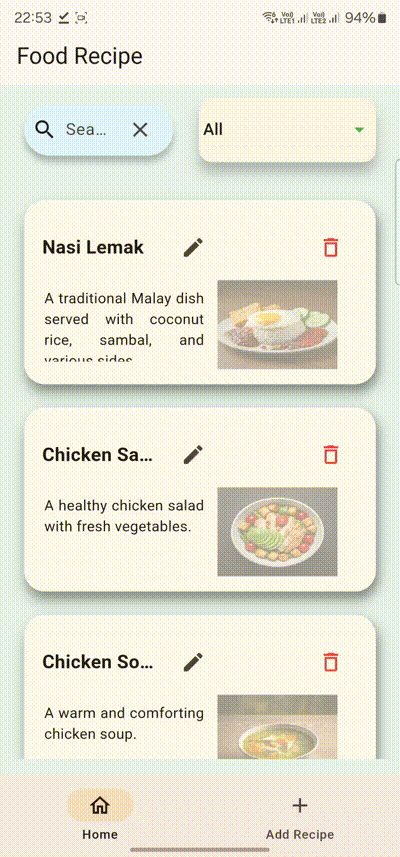
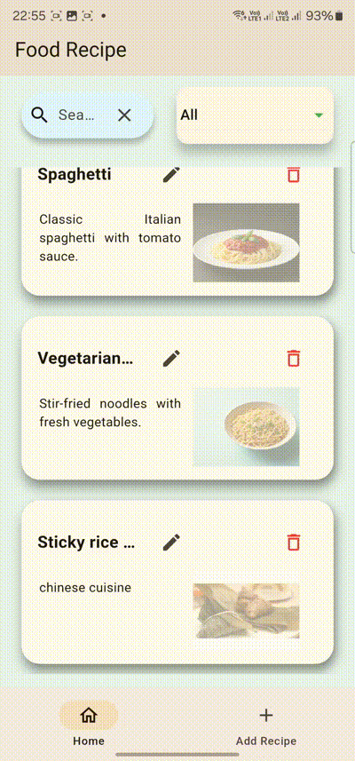

# food_recipe
- This Flutter app, created for learning purposes, provides a simple platform for managing recipes. Users can add, edit, and delete recipes, making it a great project for beginners to explore Flutter development, local database handling with Floor, and state management with GetX.

  
  
  
  

## Notes
- Intended for learning purposes only.
- Created for learning purposes by a beginner in Flutter programming. 
- The app is a basic example and will not receives any updates.
- The application has include the usage of getx state management.
- It uses the Floor local database for managing recipe data.

  
## Disclaimer:
- Use at your own risk: The author is not liable for any damage to personal devices or assets. Any issues or damages that arise are the user's responsibility.

## Dependencies:
- get: ^4.6.6
- path_provider: ^2.1.4
- permission_handler: ^11.3.1
- device_info_plus: ^10.1.2
- image_picker: ^1.1.2
- floor: ^1.5.0
- sqflite: ^2.3.3+2

## dev_dependencies:
- flutter_lints: ^4.0.0
- floor_generator: ^1.5.0
- build_runner: ^2.4.12
- json_serializable: ^6.8.0
- flutter_launcher_icons: "^0.13.1"
- flutter_native_splash: ^2.4.1
